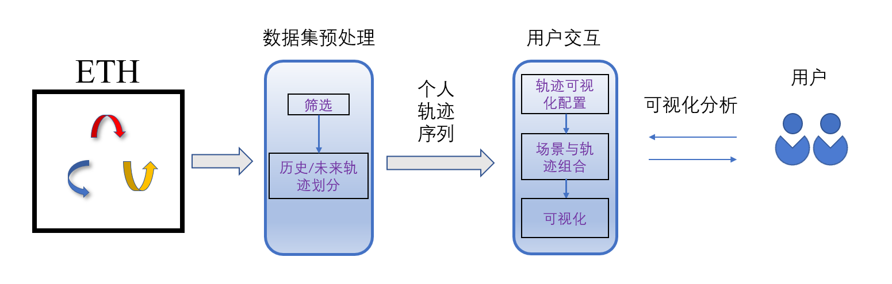

## ETH

**<a href="https://link.springer.com/content/pdf/10.1007/978-3-642-15549-9_33.pdf">Improving Data Association by Joint Modeling of Pedestrian Trajectories and Groupings</a>**

Stefano Pellegrini,  Andreas Ess, Luc Van Gool

发表在 [ECCV 2010](https://projects.ics.forth.gr/eccv2010/intro.php/)

## ETH行人及场景
<div>
    
</div>

## Setup
所有代码在Windows 10、Python 3.8上运行和测试。

你可以通过运行如下代码创建一个虚拟环境。

```bash
conda create --name s_gan               # Create a virtual environment
activate s_gan                          # Activate virtual environment
pip install -r requirements.txt         # Install dependencies
```

## 可视化
对ETH数据集的可视化方法如下图所示。
<div>
    
</div>

你可在当前路径下通过命令行运行如下命令以显示用户界面，从而执行可视化操作。（注：会出现短时间未响应问题，解决办法为在pycharm中点击运行键运行ui.py文件）
```bash
python ui.py
```

## 示例展示
如下为帧编号（frame_id）为0的轨迹序列的可视化图片及动图。
<div>
    
</div>
<div>
     
</div>
